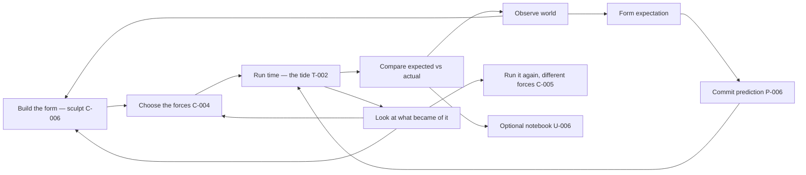
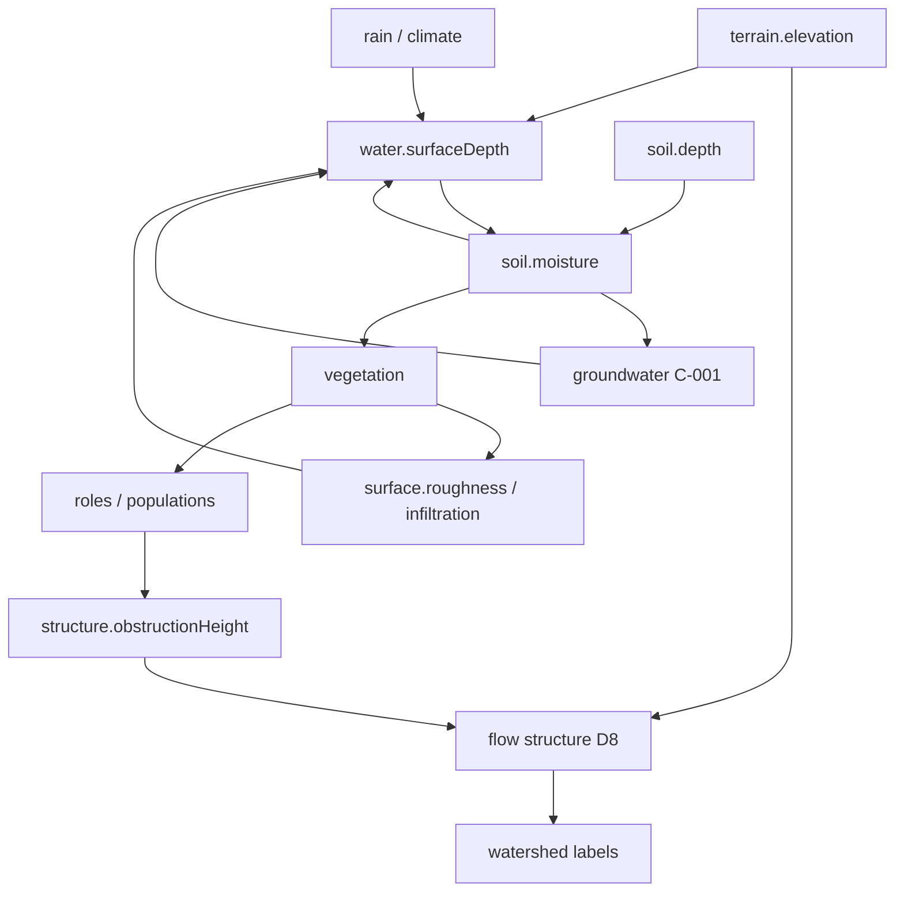

# Habitat — MVP Scope

> **Status:** Working draft  
> **Role:** Defines what the first playable Habitat proves — as a **joint** map of simulation interdependencies and game interdependencies  
> **Authority:** Subordinate to the [Decision Register](DECISION_REGISTER.md). Slice order may change; the dual-graph rule does not. Detailed execution lives in [BUILD_GUIDE.md](BUILD_GUIDE.md). Architecture detail lives in [SIMULATION_MODEL.md](SIMULATION_MODEL.md).

---

## 1. The dual-graph rule

Habitat is a coupled product. Interesting behavior lives in **feedback**, not in isolated systems. That is true twice:

| Graph | What couples | A loop is real when… | Done when… |
|---|---|---|---|
| **Simulation** | Fields and processes | A changes B and B changes A *in state* | Invariant + golden hash (T-001) |
| **Game** | Attention, verbs, readable change | The player can notice, expect, or intervene and *care* about the result | Observable without an inspector (D-006, P-003) |

**Rule.** Every slice names **both** halves. A slice that only extends the sim graph is infrastructure (allowed; must say so). A slice that only extends the game graph over fake state is forbidden (S-004, N-004).

**Anti-patterns.**

- Sim-only ladder → beautiful water toy, no verb, playtest scores stay low.  
- Game-only ladder → UI over placeholders that become load-bearing lies.  
- Closing both directions of a sim loop in one slice → cannot tell which half is wrong.

---

## 2. Target game graph (player loops)

The player fantasy is steward, not god (Design Wiki). Engagement is attention (D-006), not action throughput.

The outer ring — **build → forces → time → look** — is the thesis loop ([THESIS.md](THESIS.md) §4). The inner ring is the prediction loop, and the two are the same activity seen from different distances: thinking about how tides and gravity work *is* forming an expectation. Prediction is not a feature attached to this game; it is the mental act the sandcastle is made of.

| Edge | Register | MVP? | Notes |
|---|---|---|---|
| Build the form — abundant sculpting | A-005, **C-006** | **Yes** | Shipped Slice 5b (berm/dig). Unrationed by design; scarcity is ecological time (RC-004) |
| Choose the forces — regime control | **C-004** | **Post-MVP, thesis-critical** | The post-build verb. Today only `Rain: on/off` exists — a toggle where a regime belongs |
| Return visit — see what became of it | **C-008**, GEO-002 | **Post-MVP** | Slice 8c. The payoff exists in sim and is invisible in play |
| Run it again, different forces | **C-005** | **Post-MVP** | Needs branch/compare; T-001 determinism already supplies the hard half |
| Observe ↔ readable change | P-003, U-003, ART-001 | **Yes** | World is primary visualization |
| Expect → commit prediction | P-006 | **Yes** | Load-bearing; not polish |
| Intervene as cause, not outcome | A-005, N-001 | **Yes** | One siting verb on water/terrain is enough |
| Time rate as attention scale | T-002, S-009 | **Yes** | Already in prototype |
| Layered inspect | T-005, U-001 | **Dev yes / player selective** | Dev overlays now; player overlays later |
| Field Notebook | U-006 | **No** | Post-MVP unless playtest demands one honest sentence |
| Roles / introductions | E-007, RC-003 | **No** | Needs Slice 11-class systems |
| Scenarios / completion | G-002, G-007 | **No** | After sandbox loop works |

---

## 3. Target simulation graph (world loops)

Structural vs dynamic water, bands, and ownership: [SIMULATION_MODEL.md](SIMULATION_MODEL.md). Process math candidates: [NATURAL_PROCESS_MATH.md](NATURAL_PROCESS_MATH.md).

| Edge | Register | MVP? | Notes |
|---|---|---|---|
| Terrain → flow structure | H-002, W-002 | **Yes** | Slice 3 landed |
| Rain → surface flux | H-001 | **Yes** | Slice 1–2 |
| Surface → soil storage | H-003 | **Yes** | Slice 4 landed |
| Soil → vegetation (one-way) | ES-001 | **MVP stretch** | Slice 5 — first green |
| Vegetation → water (return) | D-003, E-005 partial | **MVP core** | Slice 6 — first true two-way ecology |
| Priority-flood / depressions | H-003 | **Yes** | Slice 4b Done (agent) |
| Soil depth / geomorphology | S-006, S-007, GEO-002, C-002 | **Post-MVP** | Slice 8 Tier-M |
| Groundwater / baseflow | H-001, H-004, **C-001** | **Done** (Locked) | Slice 8b — `baseflow-persist` |
| Fire / succession / populations | ES-*, E-* | **No** | After limiting-factor spine (Slice 9+) |
| Full beaver write-back | E-005, F-001 | **Architecture yes, breadth no** | Path must exist; one later engineer |

---

## 4. Joint slice map

Each row closes one **named** sim edge and one **named** game edge (or labels infrastructure). Sequence follows the incremental report with one deliberate reorder: **prediction (game) may attach to water before vegetation returns to water (sim Slice 6)** — register P-006 says prediction is load-bearing and water is enough once structure exists.

| Slice | Sim edge closed | Game edge closed | Status |
|---|---|---|---|
| 0–1 | — (scaffold) | Observe water motion | Done |
| 2 | Infrastructure: WorldState, registry, no-flow, clock | Time rate as attention scale | Done |
| 3 | Terrain → watershed / accumulation | Read structure via inspector | Done |
| 4 | Surface → soil moisture | Read soil memory (darkening) | **Done — playtest Pass** |
| **4b** | *(optional)* Priority-flood depressions | Ponds that stay honest | **Done** (agent; hand-derived Priority-Flood fixtures) |
| **5a** | — | **Predict water path / pool** (P-006 mechanical) | **Done — playtest Pass** |
| **5b** | Player edits terrain (berm / dig) | **Site a cause** (A-005) | **Done — playtest Pass** |
| 5 | Soil → vegetation (one-way) | Green follows wet ground | **Done — playtest Pass** |
| 6 | Vegetation → roughness / infiltration → water | See hydrograph change from plant cover | **Done — playtest Pass (sim MVP)** |
| **P** | — (observers / FX only) | **Volume without voxels** — cage, cursor, motion-in-time | **Done — Tier-P**; optional [PLAYTEST_PRESENTATION.md](PLAYTEST_PRESENTATION.md) |
| **8** | Soil depth legacy + geomorphology | Thin soil holds less; channels erode without cover | **Done — Tier-M** (Tier-O deferred) |
| **8b** | Soil ↔ GW ↔ baseflow (C-001) | Streams persist between storms | **Done** — C-001 Locked; BUILD_GUIDE §4.3 |
| **8c** | — (observers, encoding, time) | **The return visit** — build it, run time, see what nature did | **Next** — BUILD_GUIDE §4.3b; the thesis slice (**C-004**, **C-008**) |
| **9** | Limiting factors / HSI spine | Inspect why a patch is limited — the **arrival gate** (**C-007**) | Post-MVP after 8c — BUILD_GUIDE §4.4 |
| **10** | Fuel → fire disturbance → succession restart | Site a burn as a cause | After Slice 9 — BUILD_GUIDE §4.5 (authored ignition only; **C-003** Open) |
| **11+** | Succession, roles, scenarios… | Notebook, readiness, completion… | After Slice 10 |

**MVP exit.** The player can: watch water and soil; commit a prediction and be wrong or right; site one cause and see the sim respond; see vegetation blunt runoff. Sandbox only. No win condition (G-001). **Sim MVP playtest Pass** at Slice 6. **Post-MVP ladder** (autonomous-first): closeouts **done** → Slice 8b GW/baseflow **done** → Slice 8c return visit → Slice 9 Liebig/HSI → Slice 10 fire/fuel; presentation track parallel — see [BUILD_GUIDE.md](BUILD_GUIDE.md) §4. Slices 9 and 10 are specified to executable depth so an autonomous session always has two items ahead of it (BUILD_GUIDE §2 row 10).

---

## 5. What MVP is not

- A second preserve (F-003)  
- Species catalog / collection (N-003)  
- Universal score (N-002)  
- Full Field Notebook corpus (U-006)  
- Resolved RC-003 / G-007 (Open entries stay Open; architecture accommodates)  
- Voxel / cave terrain (T-007 situation-Current)  
- Falling-sand / voxel CA as the authoritative water or terrain model (presentation cues only — BUILD_GUIDE §4.2)  

---

## 6. Fun gate (before more post-MVP systems)

The Slice 4 fun gate already **Passed** ([PLAYTEST_SLICE4.md](PLAYTEST_SLICE4.md)). Before opening a new **owner** playtest for post-MVP work, pass [VERIFICATION_POLICY.md](VERIFICATION_POLICY.md) ask gate. Agent-only slices (closeouts, 8b Tier-M, hygiene) do not spend a fun-gate session.

The batch does not wait forever: it fires on the third accumulated Tier-O question, or when a slice cannot start without an answer (VERIFICATION_POLICY §4). The more the ladder is built autonomously, the more that firing rule — not the ask gate — is what keeps the world answerable to taste. **Fired 2026-07-28** into [playtests/8c-return-visit.md](playtests/8c-return-visit.md), which subsumes the batched presentation and erosion-legibility questions.

**The 20-second clip test** ([THESIS.md](THESIS.md) §8) is a self-check that costs no session: could you record twenty seconds — build, run time, watch nature take it — that reads to a stranger and makes them want to try it? When the answer is no, the next slice is whatever moves that clip closest to existing, and it is almost never a new system.

| Verdict | Action |
|---|---|
| Pass (historical) | Continue joint ladder; post-MVP order in BUILD_GUIDE §4 |
| Hold (future asks) | Agent retunes encoding / proxy — do not add Fire or roles first |
| Fail | Revisit framing / ART-001 / core loop thesis before more systems |

---

## 7. Document roles

| Document | Owns |
|---|---|
| **This file (MVP_SCOPE)** | Which loops are in/out of first playable; joint slice map |
| [SIMULATION_MODEL.md](SIMULATION_MODEL.md) | How sim interdependencies are represented |
| [DECISION_CONFORMANCE.md](DECISION_CONFORMANCE.md) | How we know a register entry is earned |
| [VERIFICATION_POLICY.md](VERIFICATION_POLICY.md) | Who verifies each claim — agent vs. owner — and the gate before any playtest request |
| [EXTERNAL_REFERENCES.md](EXTERNAL_REFERENCES.md) | External tools to study, not ship |
| [BUILD_GUIDE.md](BUILD_GUIDE.md) | Per-slice execution checklists |
| PLAYER_INTERACTION_SPEC.md | Detailed verbs and prediction UX (not yet written) |

When this document conflicts with the register, correct this document or supersede the register explicitly.
