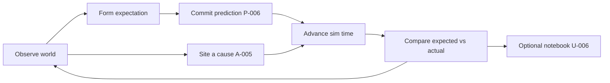
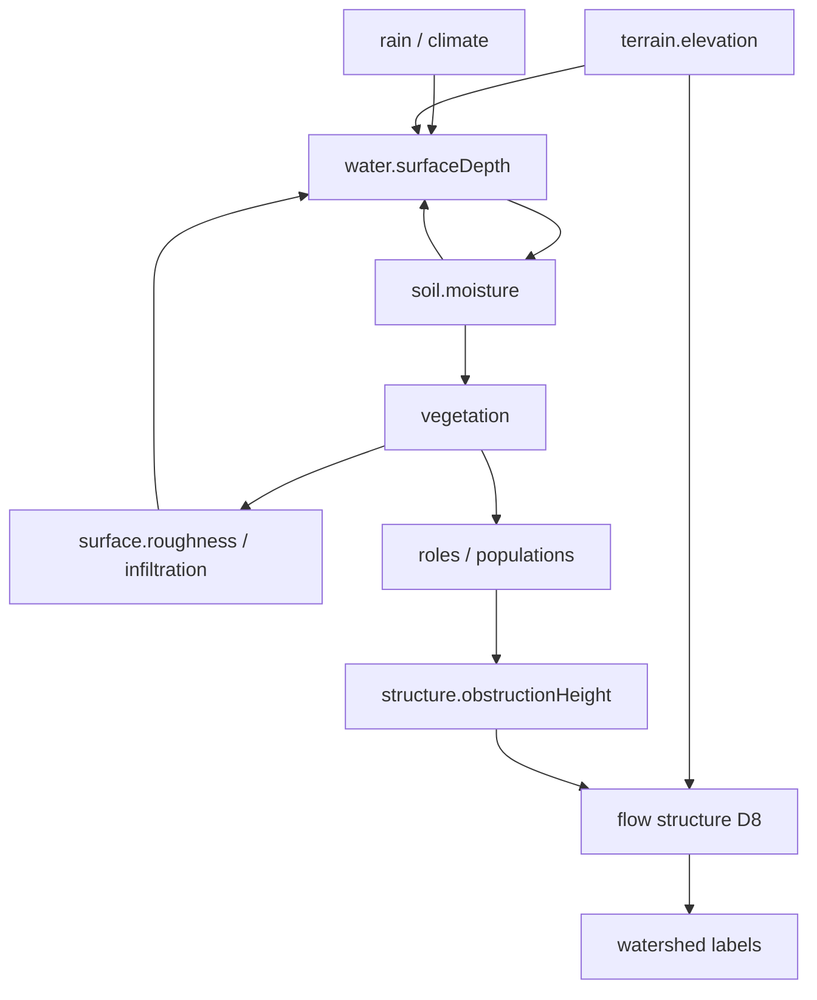

# Habitat — MVP Scope

> **Status:** Working draft  
> **Role:** Defines what the first playable Habitat proves — as a **joint** map of simulation interdependencies and game interdependencies  
> **Authority:** Subordinate to the [Decision Register](DECISION_REGISTER.md). Slice order may change; the dual-graph rule does not. Detailed execution lives in [BUILD_GUIDE.md](BUILD_GUIDE.md). Architecture detail lives in [SIMULATION_MODEL.md](SIMULATION_MODEL.md).

---

## 1. The dual-graph rule

Habitat is a coupled product. Interesting behavior lives in **feedback**, not in isolated systems. That is true twice:

| Graph | What couples | A loop is real when… | Done when… |
|---|---|---|---|
| **Simulation** | Fields and processes | A changes B and B changes A *in state* | Invariant + golden hash (T-001) |
| **Game** | Attention, verbs, readable change | The player can notice, expect, or intervene and *care* about the result | Observable without an inspector (D-006, P-003) |

**Rule.** Every slice names **both** halves. A slice that only extends the sim graph is infrastructure (allowed; must say so). A slice that only extends the game graph over fake state is forbidden (S-004, N-004).

**Anti-patterns.**

- Sim-only ladder → beautiful water toy, no verb, playtest scores stay low.  
- Game-only ladder → UI over placeholders that become load-bearing lies.  
- Closing both directions of a sim loop in one slice → cannot tell which half is wrong.

---

## 2. Target game graph (player loops)

The player fantasy is steward, not god (Design Wiki). Engagement is attention (D-006), not action throughput.

| Edge | Register | MVP? | Notes |
|---|---|---|---|
| Observe ↔ readable change | P-003, U-003, ART-001 | **Yes** | World is primary visualization |
| Expect → commit prediction | P-006 | **Yes** | Load-bearing; not polish |
| Intervene as cause, not outcome | A-005, N-001 | **Yes** | One siting verb on water/terrain is enough |
| Time rate as attention scale | T-002, S-009 | **Yes** | Already in prototype |
| Layered inspect | T-005, U-001 | **Dev yes / player selective** | Dev overlays now; player overlays later |
| Field Notebook | U-006 | **No** | Post-MVP unless playtest demands one honest sentence |
| Roles / introductions | E-007, RC-003 | **No** | Needs Slice 11-class systems |
| Scenarios / completion | G-002, G-007 | **No** | After sandbox loop works |

---

## 3. Target simulation graph (world loops)

Structural vs dynamic water, bands, and ownership: [SIMULATION_MODEL.md](SIMULATION_MODEL.md). Process math candidates: [NATURAL_PROCESS_MATH.md](NATURAL_PROCESS_MATH.md).

| Edge | Register | MVP? | Notes |
|---|---|---|---|
| Terrain → flow structure | H-002, W-002 | **Yes** | Slice 3 landed |
| Rain → surface flux | H-001 | **Yes** | Slice 1–2 |
| Surface → soil storage | H-003 | **Yes** | Slice 4 landed |
| Soil → vegetation (one-way) | ES-001 | **MVP stretch** | Slice 5 — first green |
| Vegetation → water (return) | D-003, E-005 partial | **MVP core** | Slice 6 — first true two-way ecology |
| Priority-flood / depressions | H-003 | **Soon** | Before ponds lie; RichDEM as oracle |
| Fire / succession / populations | ES-*, E-* | **No** | Post-MVP |
| Full beaver write-back | E-005, F-001 | **Architecture yes, breadth no** | Path must exist; one later engineer |

---

## 4. Joint slice map

Each row closes one **named** sim edge and one **named** game edge (or labels infrastructure). Sequence follows the incremental report with one deliberate reorder: **prediction (game) may attach to water before vegetation returns to water (sim Slice 6)** — register P-006 says prediction is load-bearing and water is enough once structure exists.

| Slice | Sim edge closed | Game edge closed | Status |
|---|---|---|---|
| 0–1 | — (scaffold) | Observe water motion | Done |
| 2 | Infrastructure: WorldState, registry, no-flow, clock | Time rate as attention scale | Done |
| 3 | Terrain → watershed / accumulation | Read structure via inspector | Done |
| 4 | Surface → soil moisture | Read soil memory (darkening) | **Done — playtest Pass** |
| **4b** | *(optional)* Priority-flood depressions | Ponds that stay honest | Optional |
| **5a** | — | **Predict water path / pool** (P-006 mechanical) | **Done — playtest Pass** |
| **5b** | Player edits terrain (berm / dig) | **Site a cause** (A-005) | **Done — playtest Pass** |
| 5 | Soil → vegetation (one-way) | Green follows wet ground | **Next** |
| 6 | Vegetation → roughness / infiltration → water | See hydrograph change from plant cover | **Sim MVP milestone** |
| 7+ | Fire, succession, roles, scenarios… | Notebook, readiness, completion… | Post-MVP |

**MVP exit.** The player can: watch water and soil; commit a prediction and be wrong or right; site one cause and see the sim respond; optionally see vegetation blunt runoff. Sandbox only. No win condition (G-001).

---

## 5. What MVP is not

- A second preserve (F-003)  
- Species catalog / collection (N-003)  
- Universal score (N-002)  
- Full Field Notebook corpus (U-006)  
- Resolved RC-003 / G-007 (Open entries stay Open; architecture accommodates)  
- Voxel / cave terrain (T-007 situation-Current)  

---

## 6. Fun gate (before more sim)

Before investing in Slice 5 vegetation, run [PLAYTEST_SLICE4.md](PLAYTEST_SLICE4.md).

| Verdict | Action |
|---|---|
| Pass (≥3, want to intervene/predict) | Continue joint ladder; prefer 5a/5b then 5→6 |
| Hold | Spike P-006 + one siting verb on water — do **not** add vegetation first |
| Fail | Revisit framing / ART-001 / core loop thesis before more systems |

---

## 7. Document roles

| Document | Owns |
|---|---|
| **This file (MVP_SCOPE)** | Which loops are in/out of first playable; joint slice map |
| [SIMULATION_MODEL.md](SIMULATION_MODEL.md) | How sim interdependencies are represented |
| [DECISION_CONFORMANCE.md](DECISION_CONFORMANCE.md) | How we know a register entry is earned |
| [EXTERNAL_REFERENCES.md](EXTERNAL_REFERENCES.md) | External tools to study, not ship |
| [BUILD_GUIDE.md](BUILD_GUIDE.md) | Per-slice execution checklists |
| PLAYER_INTERACTION_SPEC.md | Detailed verbs and prediction UX (not yet written) |

When this document conflicts with the register, correct this document or supersede the register explicitly.
